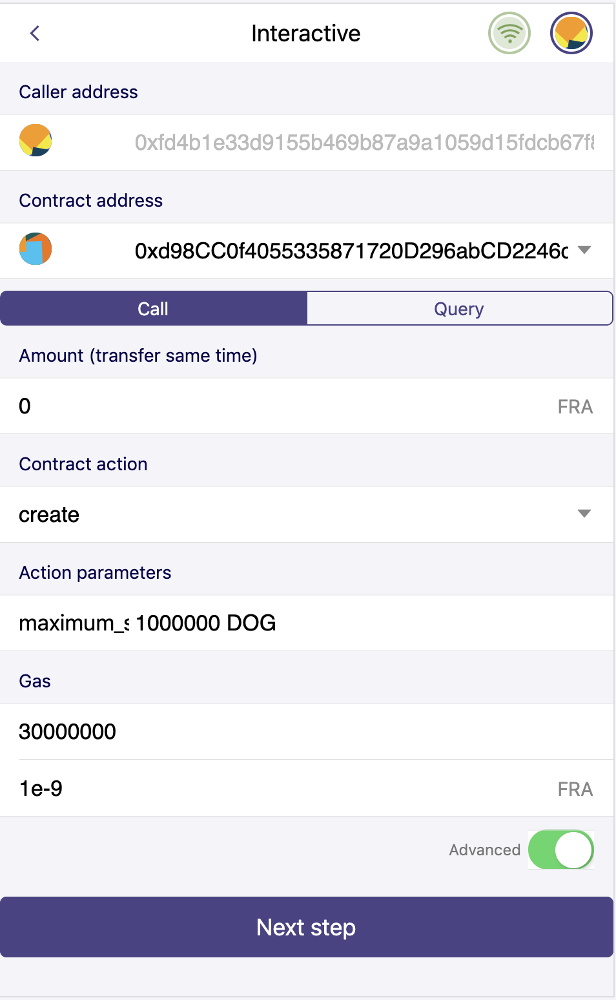
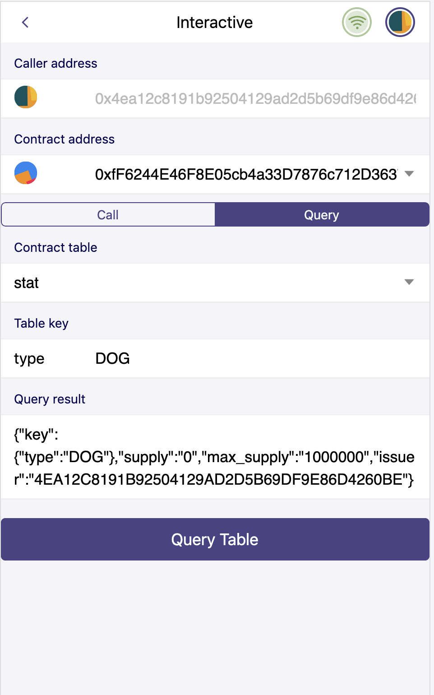
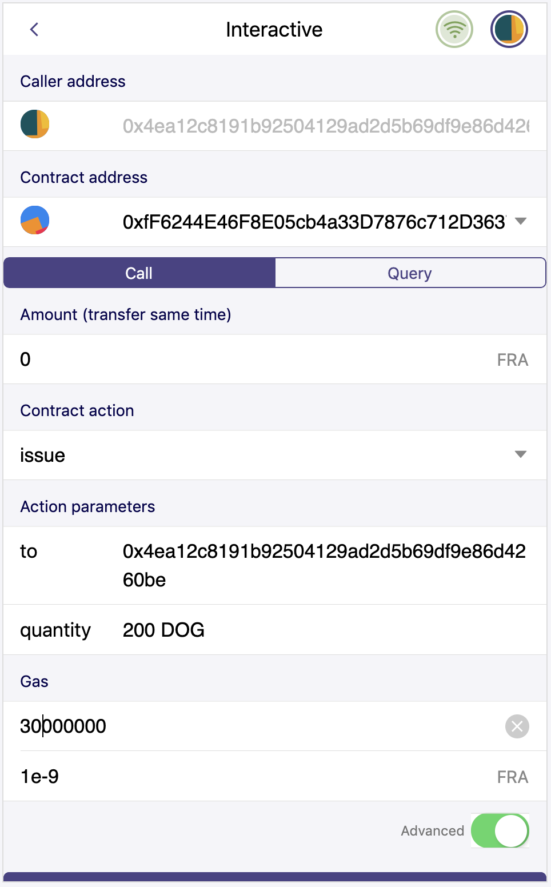
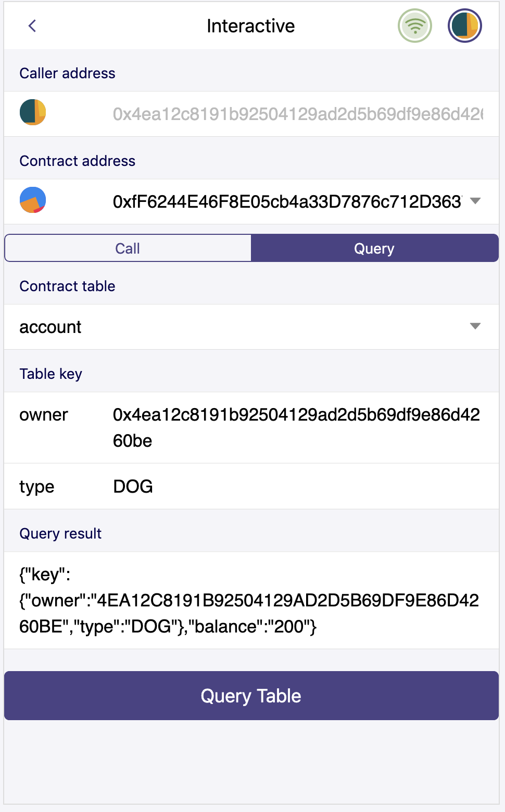
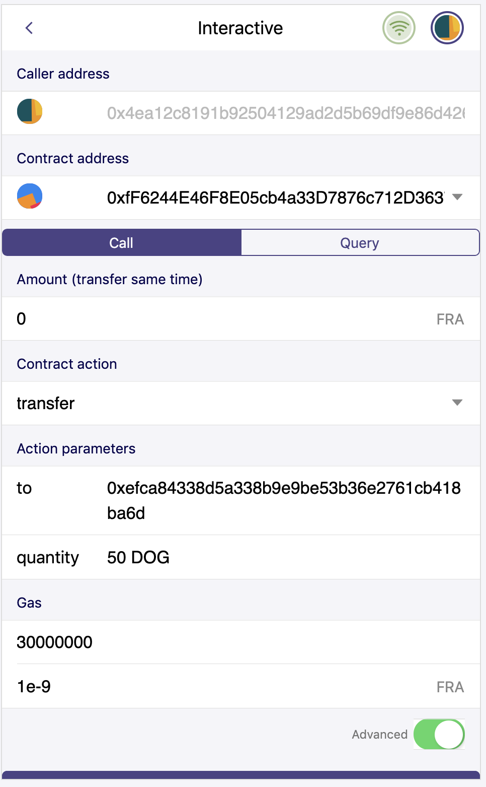
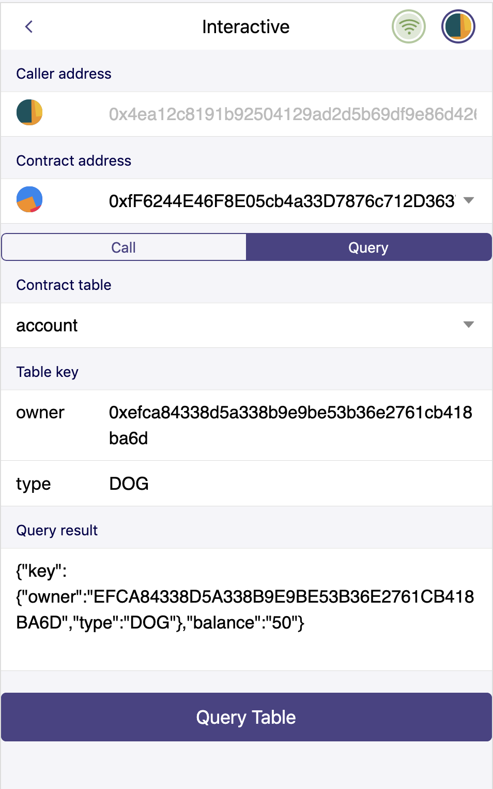

Token Contract
================

In previous articles, we have learned some basic syntax and data persistence of smart contracts. In this chapter, we will introduce a token contract, which can publish different tokens.

Step1. Create token.hpp
----------------------------

In the header file, you need to include the necessary system header file and declare a token class.

.. code-block:: C

    #pragma once
    #include <ftllib/contract.hpp>

    using namespace ftl;
    using namespace std;

    class [[ftl::contract("token")]] token : public contract {

    public:

    priviate:
    }

Step2. Declare necessary table
------------------------------

In the token contract, we need a table to record the contract information. First, the table stat is responsible for recording the information of token, including the name of token, the total amount and the dispatcher.

.. code-block:: C

    struct [[ftl::table]] stat {
        struct _key_stat{
            string type;
        } key;
        uint64_t supply;
        uint64_t max_supply;
        address issuer;
    };

    typedef table<"stat"_n,stat> stats;

Table account is responsible for recording the number of tokens held by each user. This contract can publish multiple tokens, therefore, the address of user and the symbol of token are combined, used as the primary key for account table.

.. code-block:: C

    struct [[ftl::table]] account{
        struct _key_account {
            address owner;
            string type;
        } key;
        uint64_t balance;
    };

    typedef table<"account"_n, account> accounts;

Step3. Declare necessary action
---------------------------------

First, declare an action to create tokens called ``create``. Users call this action to publish their own token. The required parameter is a variable of type asset, which defines the token's label and total amount.

.. code-block:: c

    [[ftl::action]]
    void create(asset maximum_supply);

Then, declare an action to issue tokens called ``issue``. This action issues tokens to some user. The required parameter is the user's address it wants to issue tokens to and the amount of tokens.

.. code-block:: C

    [[ftl::action]]
    void issue(vector<uint8_t> to,asset quantity);

Declare an action to retire tokens from some user called ``retire``. This action retires tokens from some user and burns them.
The required parameter is the user's address it wants to retire tokens from and the amount of tokens.

.. code-block:: C

    [[ftl::action]]
    void retire(vector<uint8_t> from, asset quantity);

Declare an action to transfer tokens to some user called ``transfer``. User calls this action to transfer tokens to designated user.
The required parameter is the user's address it wants to transfer tokens to and the amount of tokens.

.. code-block:: C

    [[ftl::action]]
    void transfer (vector<uint8_t> to, asset quantity);

Now the head file is as following:

.. code-block:: C

    #pragma once
    #include <ftllib/map.hpp>
    #include <ftllib/contract.hpp>
    #include <ftllib/address.hpp>
    #include <ftllib/asset.hpp>
    #include <ftllib/dispatcher.hpp>
    #include <ftllib/symbol.hpp>

    using namespace ftl;
    using namespace std;

    class [[ftl::contract("token")]] token : public contract {
    public:
        [[ftl::action]]
        void create(asset maximum_supply);

        [[ftl::action]]
        void issue(vector<uint8_t> to,asset quantity);

        [[ftl::action]]
        void retire(vector<uint8_t> from,asset quantity);

        [[ftl::action]]
        void transfer (vector<uint8_t> to,asset quantity);

    private:
        struct [[ftl::table]] account {
            struct _key_stat {
                address owner;
                string type;
            } key;
            uint64_t balance;
        };

        struct [[ftl::table]] stat {
            struct _key_account  {
                string type;
            } key;
            uint64_t supply;
            uint64_t max_supply;
            address issuer;
        };

        typedef table<"account"_n, account > accounts;
        typedef table<"stat"_n,stat> stats;
    };

Step4. Achieve actions
-----------------------
``create`` token.cpp and include token.cpp.

*create*

.. code-block:: CPP

    void token::create(asset maximum_supply) {
        address issuer = get_from_address();
        auto sym = maximum_supply.symbol;

        check(sym.is_valid(), "invalid symbol name");
        check(maximum_supply.is_valid(), "invalid supply");
        check(maximum_supply.amount > 0, "max-supply must be positive");

        stats statstable;
        bool existing = statstable.has_key(maximum_supply.symbol.code().to_string());
        check(existing == false, "token with symbol already exists");

        statstable.emplace([&](auto &s) {
            s.key.type = maximum_supply.symbol.code().to_string();
            s.max_supply = maximum_supply.amount;
            s.issuer = issuer;
        });
    }

First, call ``get_from_address`` function to get the caller of the action. Next, check the name of the newly defined token, the validity of the amount and whether the name of token already exists in this contract. After all checks are passed, the new token informations are recorded in the table stat and the caller is set to be issuer.

*issue*

.. code-block:: CPP

    void token::issue(vector<uint8_t> to, asset quantity) {
        auto sym = quantity.symbol;
        check(sym.is_valid(), "invalid symbol name");
        stats statstable;
        auto existing = statstable.has_key(sym.code().to_string());
        check(existing == true, "token with symbol does not exist, create token before issue");

        stat st = statstable.get(sym.code().to_string());
        address issuer = get_from_address();
        check(issuer == st.issuer, "Wrong issuer");
        check(quantity.is_valid(), "invalid quantity");
        check(quantity.amount > 0, "must issue positive quantity");
        check(quantity.amount <= st.max_supply - st.supply, "quantity exceeds available supply");

        auto pre_supply = st.supply;
        statstable.emplace([&](auto &s) {
            s.key.type = sym.code().to_string();
            s.supply = pre_supply +  quantity.amount;
            s.max_supply = st.max_supply;
            s.issuer = st.issuer;
        });

        add_balance(to, quantity);
    }

``issue`` checks whether the name of the input asset is valid and in the table stat. Next, check whether the user calling the issue method has permission to issue the specified token. Check whether the input asset is valid and its amount is greater than zero. Check whether the name of the input asset is the same as the asset name found in stat. Check whether there is sufficient balance to issue token. After verification, the amount of money already issued in stat is increased, and the token is issued to the specified user using the `add_balance` function.

*retire*

.. code-block:: CPP

    void token::retire(vector<uint8_t> from, asset quantity) {
        auto sym = quantity.symbol;
        check(sym.is_valid(), "invalid symbol name");
        stats statstable;
        auto existing = statstable.has_key(sym.code().to_string());
        check(existing == true, "token with symbol does not exist, create token before issue");

        stat st = statstable.get(sym.code().to_string());
        address issuer = get_from_address();
        check(issuer == st.issuer, "Wrong issuer");
        check(quantity.is_valid(), "invalid quantity");
        check(quantity.amount > 0, "must retire positive quantity");
        check(quantity.amount <= st.max_supply, "quantity exceeds available supply");
        sub_balance(from, quantity);
    }

``retire`` checks the validity of the name of the input asset and whether the asset exists in the table stat. Check whether the contract caller has permission to call retire action. Check whether the input asset is valid and its amount is greater than zero. Check whether the name of the input asset is the same as the asset name found in stat. Check whether the amount of the input asset exceeds the maximum value when token is defined. After the inspection is passed, the token of the specified amount will be withdrawn from the designated account and burned.

*transfer*

.. code-block:: CPP

    void token::transfer(vector<uint8_t> to, asset quantity){
        address from = get_from_address();
        check(from != to, "cannot transfer to self");

        auto sym = quantity.symbol;
        stats statstable;
        const auto &st = statstable.get(sym.code().to_string());
        check(quantity.is_valid(), "invalid quantity");
        check(quantity.amount > 0, "must transfer positive quantity");

        sub_balance(from, quantity);
        add_balance(to, quantity);
    }

``transfer`` checks that the outgoing account is not same with the inward account. Check the validity of the input asset, whether the amount is greater than 0, and whether the name is the name found from the table of stat. Check through, transfer account reduces the corresponding amount, transfer account increases the corresponding amount.

In order to achieve the transfer of tokens, it is necessary to realize the increase and decrease functions of account balance, ``add_balance`` and ``sub_balance``.

*add_balance*

.. code-block:: CPP

    void token::add_balance(vector<uint8_t> owner, asset value) {
        check(value.amount > 0, "add negative assert");

        accounts account;
        bool has = account.has_key(owner, value.symbol.code().to_string());
        if (!has) {
            account.emplace([&](auto &s) {
                s.key.owner = owner;
                s.key.type = value.symbol.code().to_string();
                s.balance = value.amount;
            });
        } else {
            auto pre_balance = account.get(owner,value.symbol.code().to_string()).balance;
            account.emplace([&](auto &s) {
                s.key.owner = owner;
                s.key.type = value.symbol.code().to_string();
                s.balance = pre_balance + value.amount;
            });
        }
    }

The ``add_balance`` function checks that the amount added cannot be negative. If the added account exists then increases its balance else set the balance to be increased amount.

*sub_balance*

.. code-block:: CPP

    void token::sub_balance(vector <uint8_t> owner, asset value) {
        check(value.amount > 0, "sub negative assert");
        accounts account;
        bool has = account.has_key(owner, value.symbol.code().to_string());
        check(has == true, "This is an empty account!");
        auto pre_balance = account.get(owner,value.symbol.code().to_string()).balance;
        check(pre_balance >= value.amount,"account don not has enough tokens");

        account.emplace([&](auto &s) {
            s.key.owner = owner;
            s.key.type = value.symbol.code().to_string();
            s.balance = pre_balance - value.amount;
        });
    }

The ``sub_balance`` function checks that the reduced balance must be positive, the reduced account exists and needs sufficient balance. After the check is passed, the corresponding account balance is reduced.

See complete code in https://github.com/fractal-platform/fractal-contract/.

Step5. Compile and deploy smart contract
----------------------------------------

You can compile your code to web assembly (.wasm) as follows:

.. code-block:: bash 

    . ~/fractal-test/fractal-cdt-bin/setenv.sh
    fractal-cpp -I. -o token.wasm token.cpp

You can deploy your smart contract by wallet:

1. Login Fractal Wallet
2. Connect to Fractal Testnet
3. Deploy smart contract(token.wasm & token.abi)

Step6. Invoke smart contract
----------------------------------------

Create your own token ``DOG``:

.. hint:: Don't forget to set the sufficient gas count.

Then you can query token stats:

Issue token:

Then query token:

Transfer token:

Then query token:

