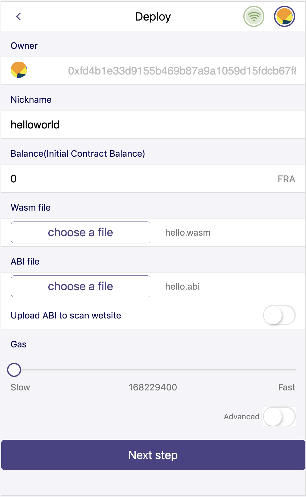
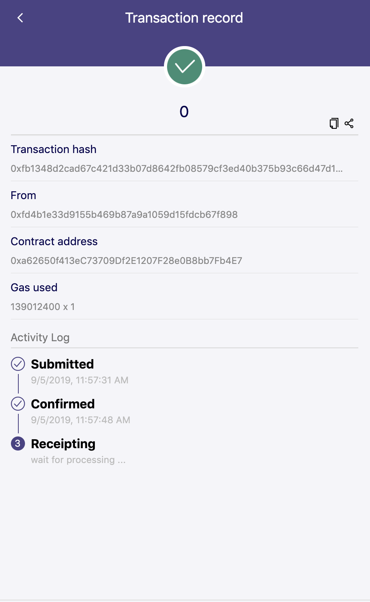
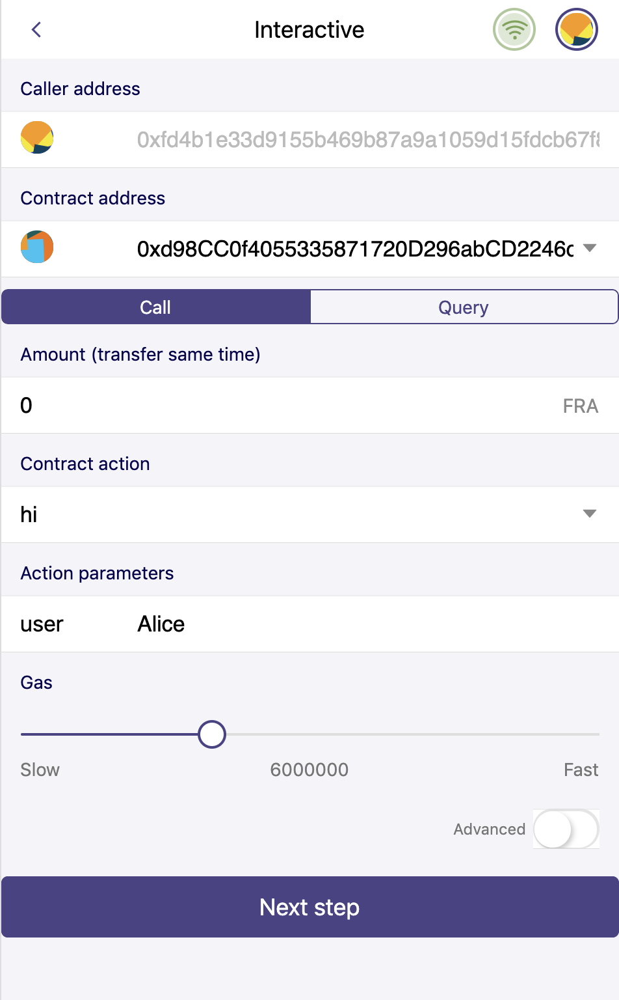
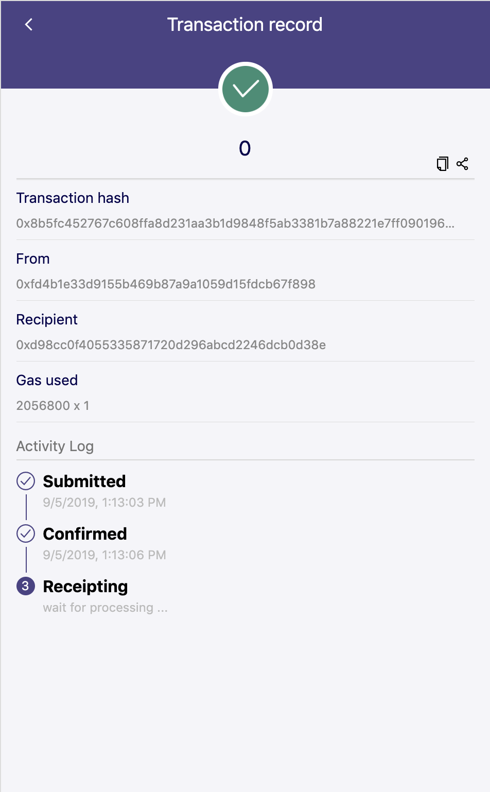

Getting Started
================

In this tutorial, you will learn how to:

- Setup Fractal CDT environment on macOS and Linux(Centos,Ubuntu)
- Write a helloworld smart contract
- Compile smart contract
- Deploy smart contract
- Invoke smart contract

Setup Fractal CDT Environment
--------------------------------

1. Download pre-build cdt zip-files from http://www.github.com/fractal-platform/.
2. Start the terminal application.
3. Decompress the release packages to the distinct directory. Run these commands in terminal:

.. code-block:: bash 

    mkdir ~/fractal-test
    cd ~/fractal-test
    mv 
    tar zxvf fractal-cdt-bin.<os>.v0.2.0.tgz

.. hint:: You should change the filename if you download a package with new version.

4. Setup enviroment. Run these commands in terminal:

.. code-block:: bash 

    cd ~/fractal-test
    . setenv.sh

5. Test installation. Run these commands in terminal:

.. code-block:: bash 

    cd ~/fractal-test
    fractal-cpp -h

If you get command help in terminal, it means that your installation is OK.

Write a helloworld smart contract
-----------------------------------

Create a new directory called "hello", and create a new file named "hello.cpp".

.. code-block:: bash 

    cd ~/fractal-test
    mkdir hello
    cd hello
    touch hello.cpp

Below the ``contract.hpp`` header file is included. The contract.hpp file includes a few classes required to write a smart contract.

.. code-block:: CPP 

    #include <ftllib/contract.hpp>

Using the ftl namespace will reduce clutter in your code. For example, by setting ``using namespace ftl``;, ``ftl::print("foo")`` can be written print("foo")

.. code-block:: CPP 

    using namespace ftl;

Create a standard C++11 class. The contract class needs to extend ``ftl::contract`` class which is included earlier from the ``contract.hpp`` header

.. code-block:: C 

    #include <ftllib/contract.hpp>

    class [[ftl::contract]] hello : public contract {};

An empty contract doesn't do much good. Add a public access specifier and a using-declaration. The ``using`` declaration will allow us to write more concise code.

.. code-block:: C 

    #include <ftllib/contract.hpp>

    class [[ftl::contract]] hello : public contract {
       public:
    };

The above action accepts a parameter called ``user`` that's a ``std:string type``. FRACTAL comes with a number of typedefs. Using the ``ftl::print`` library previously included, concatenate a string and print the ``user parameter``.

As is, the ABI GLOSSARY:ABI generator in ``fractal-cpp`` won't know about the hi() action without an attribute. Add a C++11 style attribute above the action, this way the abi generator can produce more reliable output.

.. code-block:: C 

    #include <ftllib/contract.hpp>

    class [[ftl::contract]] hello : public contract {
      public:
          [[ftl::action]]
          void hi( std::string user ) {
             print( "Hello, ", user);
          }
    };

Finally, dispatch the action in smart contract,  

Everything together, here's the completed hello world contract head file dispatcher.hpp should be included in and use ``FTL_DISPATCH`` to dispatcher actions.

.. code-block:: C 

   #include <ftllib/contract.hpp>
   #include <ftllib/dispatcher.hpp>

   using namespace ftl;

   class [[ftl::contract("hello")]] hello : public contract {
     public:
        hello(datastream<const char*> ds):contract(ds) {}
        [[ftl::action]]
        void hi() {
           printf( "Hello World" );
        } 
   };
  FTL_DISPATCH(hello,(hi))

Compile smart contract
------------------------------

You can compile your code to web assembly (.wasm) as follows:

.. code-block:: bash 

    cd ~/fractal-test
    . setenv.sh
    fractal-cpp -o hello.wasm hello.cpp

Above command generates two file hello.wasm and hello.abi. hello.wasm is the file for web assembly byte code, and hello.abi is the api description file for contract.

Deploy smart contract
------------------------------

1. Login Fractal Wallet
2. Connect to Fractal Testnet
3. Deploy smart contract

Then you can get receipt in wallet:

You can get [Contract Address] in this page.

Invoke smart contract
------------------------------

1. Login Fractal Wallet
2. Connect to Fractal Testnet
3. Invoke smart contract

Then you can get receipt in wallet:

